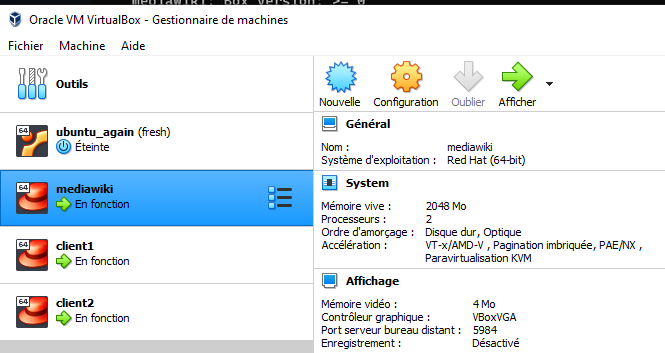
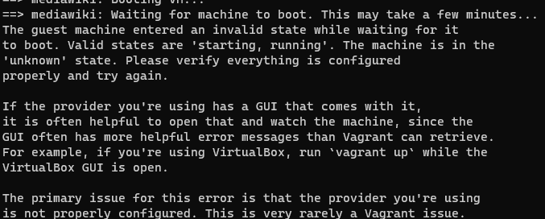

# Projet A - ITS

## Contexte  
Ce projet vise à la mise en place d'un environnement virtualisé déployé automatiquement pour **Mediawiki**. L'objectif est de mettre en place  l'architecture suivante :  
  

## Environnement cible  
On va donc mettre en place 3 machines qui seront configurées via un script Vagrant :  
    * un load balancer/reverse proxy **Nginx**  
    * deux serveurs applicatifs **Mediawiki**  
    * une base de données **MariaDB** (hébergée sur l'un des serveurs applicatifs)  
  
# Contributeurs  
[Jonathan](https://github.com/edizbak "edizbak")  
[Jorge](https://github.com/Jrgds "Jrgds")  
[Tigran](https://github.com/Tigran69LYON "Tigran69LYON")  
[Yousra](https://github.com/youyou07 "youyou07")  

# Problématique  
Comme nous disposions d'un temps limité, nous nous sommes répartis les tâches à effectuer de manière à disposer d'une solution fonctionnelle au bout d'une semaine de développement.  
Un déroulé des actions entreprises par chacun est disponible [en seconde partie de ce readme](#jour-1)  

# Installation
## Pré-requis
Pour pouvoir utiliser ce projet il vous faut avoir installé sur votre machine :  
* [Vagrant](https://developer.hashicorp.com/vagrant/downloads) ver. 2.36
* [VirtualBox](https://www.virtualbox.org/wiki/Download_Old_Builds_6_1) ver. 6.1
* [git](https://git-scm.com/downloads) ou un IDE intégrant git (par exemple [VSCode](https://code.visualstudio.com/Download))  

## Étapes - Installation
* Premièrement, on créé un dossier dans lequel on installera le projet, par exemple dans *Documents* :  
  
* Ensuite, soit on se place dans ce dossier avec **git bash** puis on clone le repo :  
  
  
```
git clone https://github.com/edizbak/ITS-ProjetA.git
```
  
* soit on utilise notre **IDE** intégrant **git** pour cloner le repo (en n'oubliant pas de se placer dans le dossier *Mon Projet*) :  
  
* et enfin on peut lancer la commande ```vagrant up``` dans une invite **Powershell** ou **Terminal**, *en faisant bien attention à s'être préalablement placé dans le dossier* **ITS-ProjetA** *!* :  
  
* si tout s'est bien déroulé (attendre le retour du prompt **Powershell**) on peut se connecter à notre application **Mediawiki** via l'URL https://192.168.99.30/mediawiki :  

  
On note l'alerte de sécurité qui est dûe au fait que notre certificat de sécurité est auto-signé ; c'est normal et il n'y a pas de souci à se faire.

## Etapes - Exploitation  
* pour gérer nos machines, on peut se connecter via **ssh** en spécifiant le nom de la machine à laquelle on souhaite se connecter, par exemple *mediawiki1* :  
```vagrant ssh mediawiki1```  
* les 3 machines disponibles sont *nginx, mediawiki1* et *mediawiki2*  
* une sauvegarde automatique de la base de données est activée par défaut et se lance à 3h00 tous les jours, mais on peut également la lancer manuellement **uniquement sur mediawiki1** après s'être connecté en tapant la commande  
```
./db_bkup.sh
```  
* enfin, on peut lancer une restauration de la base de données toujours en étant connecté sur *mediawiki1* en tapant la commande  
```
./db_restore.sh
```  
Si on connaît déjà le titre du fichier de backup à restaurer, on peut la lancer ainsi :  
```
./db_restore.sh <nom_de_fichier>
```  
* Concernant **LVM** ( Logical Volume Management ), il est également possible d'augmenter la taille du volume logique configuré sur *mediawiki2* en suivant la procédure suivante :  
S'il y a suffisamment d'espace de stockage disponible sur le VG: dans ce cas il est possible de redimensionner le LV et d'agrandir le FS en même temps avec l'option -r. Il faut exécuter dans le terminal la commande:

Exemple, avec la syntaxe:  
```sudo lvextend -r -L +<taille_ajoutee> <nom_volume_logique>```  
exemple:  
```
sudo lvextend -r -l 10%VG /dev/vg1/part2  
sudo lvextend -r -L +1G /dev/vg1/part2
```  
S'il n'y a pas suffisamment d'espace de stockage disponible sur le VG: on peut ajouter un PV et réaliser l'extension du VG:
1. Il faut créer un nouveau disque dur virtuel supplémentaire
2. On déclare le nouveau disque dur virtuel (/dev/sde) en Volume Physique LVM  
```
 sudo pvcreate /dev/sde
```  
3. Puis on ajoute le PV au Groupe de Volumes LVM (vg1)
```
 sudo vgextend vg1 /dev/sde
```
4. On peut maintenant étendre la taille des Volumes Logiques, par exemple: 
```
sudo lvextend --size +1G /dev/vg1/part2
```  
5. Et ensuite augmenter la taille de la partition qu’ils contiennent :  
```
sudo resize2fs /dev/vg1/part2
```

---
# Déroulé du projet
# Jour 1

## Configuration initiale des VM

En premier lieu, on a récupéré les fichiers Vagrantfile et install_ansible.sh à partir du repo https://github.com/diranetafen/cursus-devops/tree/master/vagrant/ansible Ces fichiers vont nous servir de base et on va les éditer afin qu'ils correspondent à nos besoins (puisque nous ne souhaitons pas particulièrement installer Ansible sur nos VMs).
    la première action est donc de remplacer ansible par mediawiki dans le fichier Vagrantfile
    on met ensuite en commentaire la plupart des actions du script install_ansible.sh, l'installation de Mediawiki à proprement parler sera effectuée ultérieurement

On teste l'exécution du Vagrantfile (ne pas oublier de se placer dans le répertoire où sont nos fichiers !) :
vagrant up


Une première erreur apparaît : Erreur Vagrant



Une rapide recherche google nous apprend que le problème vient d'un certificat self-signed comme il en existe tant... [Des détails ici](https://github.com/edizbak/projet_A_ITS/blob/master/stories/certif_kaspersky.md)

La solution retenue est d'ajouter une ligne à la config dans Vagrantfile :
```
mediawiki.vm.box_download_insecure=true
```
Probablement à proscrire en contexte réel si on n'est pas certain de l'identité du serveur contacté par vagrant pour télécharger l'image désirée

On relance l'exécution du Vagrantfile pour tomber sur une nouvelle erreur : 
2nde Erreur Vagrant

Celle-ci semble provoquée par le délai induit par l'UAC Windows, erreur bénigne donc. On détruit l'environnement, on relance, et la troisième tentative aboutit enfin :  
  

On s'auto-congratule modérément et on commence les recherches sur l'installation de Mediawiki pour le lendemain... Ça va être sympa, on va devoir installer PHP, une base de donnée, extraire plein de fichiers, bref il va y avoir de quoi faire !  

# Jour 2
## On reprend les tentatives d'installation de Mediawiki
Avec l'esprit un peu plus clair, on installe les dépendances sans spécifier de numéro de version et le script arrête de se plaindre :
```
sudo apt-get install php php-apcu php-common php-intl php-json php-mbstring php-mysql php-xml mariadb-server apache2
```
# Jour 3
# Installation de Mediawiki
Constatant qu'il reste une partie configuration de **Nginx** pour **PHP** qui nous échappe complètement, décision est prise d'abandonner **CentOS 7** pour utiliser à la place une distribution **Debian** qui comprend un paquet **Mediawiki** qui configure **Apache, MariaDB et PHP** automatiquement.

# Installation NGINX
On récupère une version plus récente de **Nginx** que celle présente dans les paquets **Debian**, :  
```
sudo apt install curl gnupg2 ca-certificates lsb-release debian-archive-keyring
curl https://nginx.org/keys/nginx_signing.key | gpg --dearmor \
    | sudo tee /usr/share/keyrings/nginx-archive-keyring.gpg >/dev/null
echo "deb [signed-by=/usr/share/keyrings/nginx-archive-keyring.gpg] \
http://nginx.org/packages/mainline/debian `lsb_release -cs` nginx" \
    | sudo tee /etc/apt/sources.list.d/nginx.list
echo -e "Package: *\nPin: origin nginx.org\nPin: release o=nginx\nPin-Priority: 900\n" \
    | sudo tee /etc/apt/preferences.d/99nginx
sudo apt update
sudo apt install nginx
```

## Configuration de LoadBalancer, Reverse Proxy et de Certificat Autosigné
On commence avec LoadBalancer, on configure le fichier nginx.conf
Il y a 2 instances de la même application qui tournent sur VM#2 et VM#3. On ajoute les adresses des deux serveurs dans l'upstream.
Le serveur auquel une requête est envoyée est déterminé à partir de l'adresse IP du client. La directive *IP_hash* garantit que les requêtes provenant de la même adresse parviennent au même serveur, sauf si celui-ci n'est pas disponible. Toutes les demandes sont transmises au groupe de serveurs "mediawiki", et **Nginx** applique la répartition de charge HTTP pour distribuer les demandes. Avec la commande "backup" nous ajoutons en mode désactivé une chaîne qui peut être activée ultérieurement si nécessaire en manuel. 
Cela permet de mettre un serveur en réserve et d'effectuer toutes les requêtes avec un seul serveur. Le serveur backup sera utilisé en cas de défaillance du serveur principal.

On continue de configurer le reverse proxy, on se deplace vers le dosier avec le fichier *default.conf* et on fait la redirection du location / vers proxy_pass /mediawiki.  
Creation des Clé privée, CSR (Certificate Signing Request) et Certificat auto-signé.
Avant de configurer le serveur https, nous devons préparer une clé privée, une demande de signature de certificat (CSR) et un certificat signé avec sa propre clé privée.
Nous créons la clé privée et la CSR (Certificate Signing Request) à l'aide d'une seule commande. 
Nous voulons que notre clé privée ne soit pas chiffrée, donc on ajoute l'option -nodes.
Avec help -subj, nous pouvons fournir des réponses aux questions interactives nécessaires pour obtenir la clé privée et le CSR.
Un certificat auto-signé est un certificat signé avec sa propre clé privée. Il peut être utilisé pour crypter des données aussi bien que les certificats signés par l'autorité de certification, mais un avertissement indiquant que le certificat n'est pas fiable s'affichera à l'écran.
Pour des raisons de sécurité, nous devons conserver les droits au minimum requis pour assurer la fonction du serveur https.

Configuration de serveur https. 
On se deplace ver le dosier de fichier default.conf. On ajoute listen 443 ssl.
Pour minimiser le nombre d'opérations le SSL handshake et économiser les ressources CPU:
1) on a activé les connexions keepalive et augmenté timeouts pour envoyer plusieurs demandes via une seule connexion;
2) réutiliser les paramètres de la session SSL afin d'éviter les négociations SSL pour les connexions parallèles et ultérieures.

On sauvgarde ssl_certificate et ssl_certificate_key dans le repertoir /etc/ssl. On sélectionne les protocoles et ciphers à supporter dans  ssl_protocols et ssl_ciphers.

# LVM ( Logical Volume Management )

Avant d'implémenter une solution de stockage LVM, nous avons créé un disque dur virtuel supplémentaire avec la taille 8GB et sur la VM Mediawiki2.

Voir dans le Vagrantfile les lignes 46 jusqu'à 49.


Ensuite, nous avons implémenté une solution de stockage LVM sur la VM Mediawiki2 avec:

1 disque dur virtuel en Volume Physique LVM dedans le VG (Volume Group) et 2 LV (Logical Volume) dedans le VG (Volume Group).

Dans la dernière étape, nous avons modifié le fichier /etc/fstab pour activer le montage automatique des partitions au démarrage du système d'exploitation.


```
LVMLOGS_FILE="/tmp/mise_en_place_lvm.log"

echo -e "You will find LVM provisionings logs below"  > ${LVMLOGS_FILE}

if [ $1 == "node2" ]

then


 #Mise en place d'une solution de stockage LVM:

 #Vérification de la présence des disques durs

 echo "Vérification de la présence des disques durs." >> ${LVMLOGS_FILE}

 lsblk >> ${LVMLOGS_FILE}


 # Installation du package LVM

 echo "Installation du package LVM." >> ${LVMLOGS_FILE}

 apt-get -y install lvm2

 echo $? >> ${LVMLOGS_FILE}


 # On déclare le(s) disque(s) dur(s) virtuel(s) en Volume Physique LVM (PV = Physical Volume)

 echo "On déclare le(s) disque(s) dur(s) virtuel(s) en Volume Physique LVM." >> ${LVMLOGS_FILE}

 pvcreate /dev/sdb

 echo $? >> ${LVMLOGS_FILE}


 # Visualisation des PV

 echo "Visualisation des PV." >> ${LVMLOGS_FILE}

 lvmdiskscan >> ${LVMLOGS_FILE}

 pvdisplay >> ${LVMLOGS_FILE}


 # Création d’un VG (Volume Group)

 echo "Création d’un VG." >> ${LVMLOGS_FILE}

 vgcreate vg1 /dev/sdb

 echo $? >> ${LVMLOGS_FILE}


 # Visualisation des VG

 echo "Visualisation des VG." >> ${LVMLOGS_FILE}

 vgdisplay --units=G >> ${LVMLOGS_FILE}

 vgs >> ${LVMLOGS_FILE}


 # Création des LV (Logical Volume), option -n pour le nom

 echo "Création de LV part1." >> ${LVMLOGS_FILE}

 lvcreate -l 70%VG -n part1 vg1

 echo $? >> ${LVMLOGS_FILE}

 echo "Création de LV part2." >> ${LVMLOGS_FILE}

 lvcreate -l 10%VG -n part2 vg1

 echo $? >> ${LVMLOGS_FILE}


 # Visualisation des LV

 echo "Visualisation des LV." >> ${LVMLOGS_FILE}

 lvscan >> ${LVMLOGS_FILE}

 lvdisplay >> ${LVMLOGS_FILE}


 #  Formatage en EXT4, option -t pour le type de système de fichiers

 echo "Formatage en EXT4 de part1." >> ${LVMLOGS_FILE}

 mkfs -t ext4 /dev/vg1/part1

 echo $? >> ${LVMLOGS_FILE}

 echo "Formatage en EXT4 de part2." >> ${LVMLOGS_FILE}

 mkfs -t ext4 /dev/vg1/part2

 echo $? >> ${LVMLOGS_FILE}


 # Création des points de montage

 echo "Création du point de montage de part1." >> ${LVMLOGS_FILE}

 mkdir /my_lvm_volume1

 echo $? >> ${LVMLOGS_FILE}

 echo "Création du point de montage de part2." >> ${LVMLOGS_FILE}

 mkdir /my_lvm_volume2

 echo $? >> ${LVMLOGS_FILE}


 # Montage du système de fichiers, sur les points de montage

 echo "Montage du système de fichiers, sur le point de montage de my_lvm_volume1." >> ${LVMLOGS_FILE}

 mount /dev/vg1/part1 /my_lvm_volume1

 echo $? >> ${LVMLOGS_FILE}

 echo "Montage du système de fichiers, sur le point de montage de my_lvm_volume2." >> ${LVMLOGS_FILE}

 mount /dev/vg1/part2 /my_lvm_volume2

 echo $? >> ${LVMLOGS_FILE}


 # Modification du fichier /etc/fstab pour activer le montage automatique des partitions au démarrage du système d'exploitation

 echo "Modification du fichier /etc/fstab pour activer le montage automatique des partitions au démarrage du système d'exploitation" >> ${LVMLOGS_FILE}

 file="/etc/fstab"

 echo $? >> ${LVMLOGS_FILE}


 echo "Copie du morceau de ligne du fichier /etc/fstab depuis <ext4> et jusqu'à la fin de la même ligne." >> ${LVMLOGS_FILE}

 text=$(sed -n 's/.*\(ext4[[:space:]]*.*\)$/\1/p' $file)

 echo $? >> ${LVMLOGS_FILE}


 echo "Les nouvelles lignes qu'on doit ajouter." >> ${LVMLOGS_FILE}

 line1="/dev/vg1/part1 /my_lvm_volume1 $text"

 line2="/dev/vg1/part2 /my_lvm_volume2 $text"

 echo $? >> ${LVMLOGS_FILE}


 echo "Les nouvelles lignes sont mises dans le fichier /etc/fstab, après la ligne que commence par UUID." >> ${LVMLOGS_FILE}

 sed -i "/^UUID/ a\\$line1\n$line2" $file

 echo $? >> ${LVMLOGS_FILE}


fi
```
--------------------------------------------------------------------------------

Le défi rencontré: il arrive parfois (aprés exécuter plusieurs fois les commandes vagrant up et vagrant destroy) avoir un erreur pendant la création d'un disque dur virtuel de façon automatique via le lignes de commandes placées dans le fichier Vagrantfile, que nous informe que le nom du nouveau disque dur virtuel que nous voulons créer a déjà été créé. Voir la photo en pièce jointe du l'erreur. Dans cette situation, il faut récupérer une liste complète de tous les disques durs virtuels que sont stockés dans la configuration globale de Virtual Box, (noms de fichiers et les UUID de chaque disque virtuel) à l'aide de la commande suivante :
   
   vboxmanage list hdds
   
   Et ensuite on peut supprimer une entrée de la liste et rendre à nouveau disponible le nom du fichier, avec la commande suivante :
   
   vboxmanage closemedium disk <uuid> --delete
   
   Après éxecuter cette commande, nous pouvons essayer de créer à nouveau un nouveau disque dur virtuel avec le même nom de fichier.
